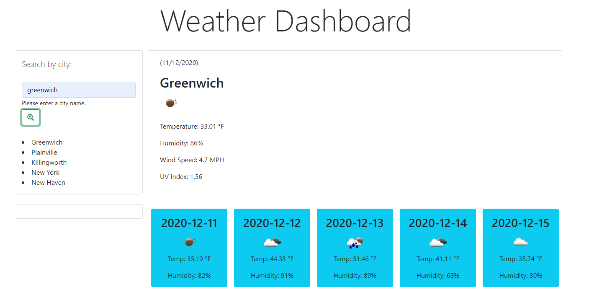

# Weather-Ex-Machina :robot:

**A Weather Dashboard App :sunny: :cloud: created with JQuery, the OpenWeatherMap API, and love**

## User Story

```
AS A traveler
I WANT to see the weather outlook for multiple cities
SO THAT I can plan a trip accordingly
```

## Acceptance Criteria

```
GIVEN a weather dashboard with form inputs
WHEN I search for a city
THEN I am presented with current and future conditions for that city and that city is added to the search history
WHEN I view current weather conditions for that city
THEN I am presented with the city name, the date, an icon representation of weather conditions, the temperature, the humidity, the wind speed, and the UV index
WHEN I view the UV index
THEN I am presented with a color that indicates whether the conditions are favorable, moderate, or severe
WHEN I view future weather conditions for that city
THEN I am presented with a 5-day forecast that displays the date, an icon representation of weather conditions, the temperature, and the humidity
WHEN I click on a city in the search history
THEN I am again presented with current and future conditions for that city
WHEN I open the weather dashboard
THEN I am presented with the last searched city forecast
```

## Features

###### :heavy_check_mark: Simple and intuitive design
###### :heavy_check_mark: User has the ability to search the city of their choosing for the weather
###### :heavy_check_mark: User history displays previously searched cities directly below search box
###### :heavy_check_mark: Clicking previously searched cities will display their weather again
###### :heavy_check_mark: When a user clicks search button, current weather for the area is displayed in the large text box
###### :heavy_check_mark: 5-day forcast is displayed directly below current weather showing large dates, temps and humidity
###### :heavy_check_mark: Weather Icons display according to weather prediction showing the type of weather to plan for

### Screenshot of Work



### Deployed Page

https://peter-izzo.github.io/Weather-Ex-Machina/
